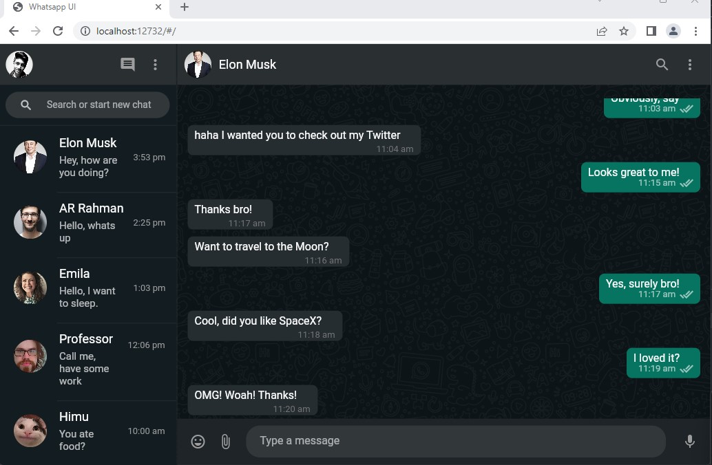

# Responsive Whatsapp UI Clone

A completely Responsive Whatsapp UI App- works on Android, iOS, Web & Desktop! Works as WhatsApp App on Smaller Screen Sizes and WhatsApp Web on Bigger Screen Sizes!


## Screenshot



## Installation
After cloning this repository, migrate to ```whatsapp-flutter-ui``` folder. There, run the following commands:
```bash
  flutter pub get
  flutter run -d chrome --web-renderer html (to see the best output)
```
    


## 🔗 Links
[](https://arrahmanbd.blogspot.com/)
[](https://www.linkedin.com/arrahmanbd)